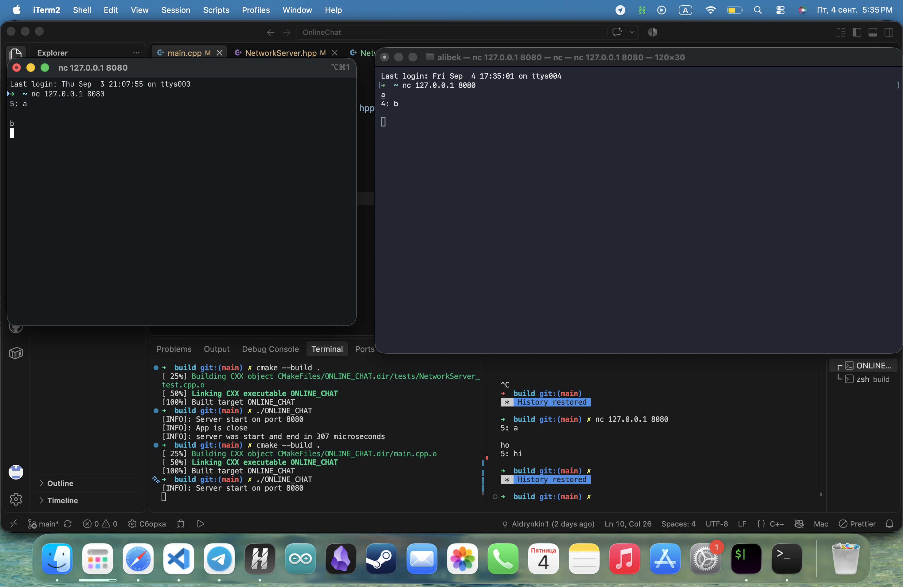

# Online chat

**Online chat** — это легковесный чат без внутренней базы данных и сохранения сообщений, для сохранения конфиденциальности



## 🛠 Стек технологий 
* **Язык:** C++ 17

## Установка и запуск

### Требования
Для сборки проекта вам понадобятся `CMake`.

### Пошаговая сборка

1. Создайте новую папку, откройте в ней терминал и клонируйте репозиторий:
   ```bash
   git clone https://github.com/Aldrynkin1/OnlineChat
   cd OnlineChat
   ```

2. Создайте директорию для сборки и перейдите в неё:
   ```bash
   mkdir build
   cd build
   ```

3. Сгенерируйте файлы сборки через CMake и скомпилируйте проект:
   ```bash
   cmake ..
   cmake --build .
   ```

## Разработчик
* **Дрынкин Альберт** — [@diamondsonmykok]
